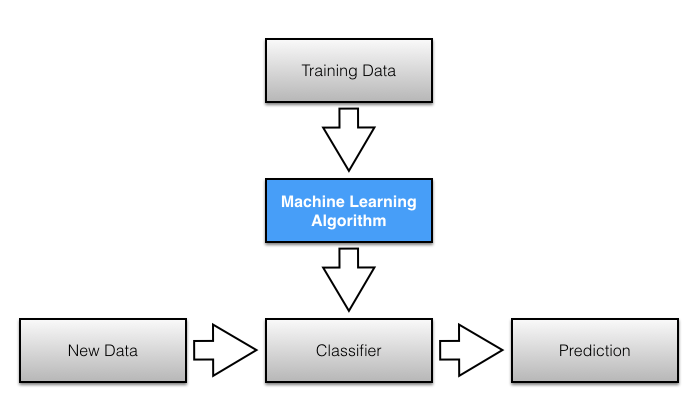

# 
 Final Capstone Proposal - Soccer Match Results Prediction  

## 
  

## Purpose, Background Information & Motivation
The purpose of my capstone project is to predict the winning team in a soccer game in the English Premier League ([EPL](https://www.premierleague.com/)) based on expected average goals (per game, and/or differentials). The major problem that I aim to tackle with my model is the uncertainty and variability in soccer influenced by many factors ranging from player performance to team performance to manager tactical decisions (formations, lineup selection). In sports, the betting odds industry is a significant financial industry that is based on the ability to accurately predict the outcome of games based on different factors.  Furthermore, soccer teams develop "winning stategies" by studying pevious performances to minimize negatives and maximize positives. The presence of a model that can help teams pinpoint a few key factors that have a significant postive impact on their future performance will be very important in better financial expenditures from increasing efficiency in improving relevant tactical strategies. Below are some resources (papers, videos, etc.) that have solved similar problems of winning team prediction in soccer using different machine learning models, and different features that guide the definition of success.
  - [Predicting The Result Of English Premier League Soccer Games With The Use Of Poisson Models ](https://www2.stetson.edu/~efriedma/research/boldrin.pdf)
  - [Predicting Soccer Match Results in the English Premier League](http://cs229.stanford.edu/proj2014/Ben%20Ulmer,%20Matt%20Fernandez,%20Predicting%20Soccer%20Results%20in%20the%20English%20Premier%20League.pdf)
  - [What Is the Best Method for Predicting Football Matches?
](https://cartilagefreecaptain.sbnation.com/2014/3/5/5473358/what-is-the-best-method-for-predicting-football-matches)
  - [The Beautiful Game: Predicting the Premier League with a random model](https://towardsdatascience.com/o-jogo-bonito-predicting-the-premier-league-with-a-random-model-1b02fa3a7e5a)
  - [Predicting Football Results With Statistical Modelling](https://dashee87.github.io/football/python/predicting-football-results-with-statistical-modelling/)

From the resources above and others online, poisson models were widely used due to the discrete probabilty distribution nature of a 90-minute match game in soccer for goals per game and the understanding of poisson distribution. Classifier models (linear stochastic gradient descent, naive bayes, support vector machines (SVM), random forest, markov model, etc.) were also used in some cases to explicitly predict either a win, draw or loss.

## Presentation
 The capstone project will be presented during Capstone shwocase using a presentation slideshow (possibility of web app given time constraint and substantial positive project progress).

## Data Sources
My goal is to obtain data from the sources (team, and player) below. [WhoScored.com](https://www.whoscored.com/) collects data for 15,000 games across 5 different leagues (England, Spain, Italy, France and Germany). For this capstone project, the focus will be the English Premier League, as such only data from England will be used. Currently, webscraping functions are being written to scrape the dataset, while mongoDB or Postgres-SQL DB will be the storage location for the dataset.
1) [WhoScored - Team Statistics](https://www.whoscored.com/Statistics)
2) [WhoScored - Player Statistics](https://www.whoscored.com/Regions/252/Tournaments/2/Seasons/6829/Stages/15151/PlayerStatistics/England-Premier-League-2017-2018)
3) [WorldFootball - EPL statistics](https://www.worldfootball.net/stats/eng-premier-league/)

## Potential Problems
 Potential problems include superficial or no focus on the most important features due to large number of features, the temporal nature of the dataset, limited relevant data from the dataset and the definition of success/win for non-classifier models, amongst the wide range of problems. The issue of identifying the most important features can be reduced by studying the underlying principle behind the choices of target variables with respect to features in other good widespread models. The temporal nature of the dataset can be handled by a TimeSeriesSplit class which takes into account the time dependency of the dataset. With the issue of limited data, given a running model for soccer in England, the model can be expanded to the other 4 countries (France, Spain, Italy and Germany) that constitute the top 5 soccer leagues in Europe.

## What Next?
 Currently, webscraping and data cleaning functions are being developed to scrape the dataset from the website and then clean the dataset to a state that can be used to create the model. Also, merging datasets from WhoScored and WorldFootball dataset will be the next step after successful deployment of the webscrape functions. Relevant features that influence the model include goals, assists, shots, chances created, tackles won, blocks, clearances, crosses, dribbles, passes made, interceptions, fouls, yellow cards and red cards. There are specific features that affect the chances of winning a game more than others. From background information research, shots and chances created seem to be the most important while dribbles and yellow cards are the least important. And as such, explicit target variable definition based on feature selection for non-classifier models is on the to-do list.

